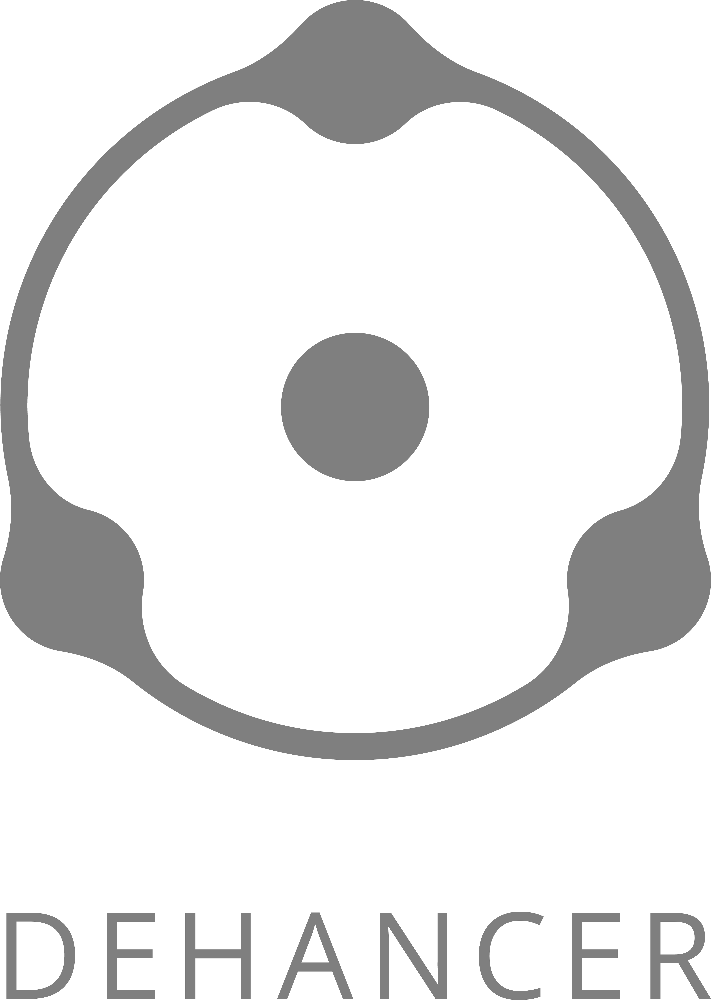

[](https://github.com/astral-sh/ruff)


# Dehancer CLI

## Overview

<table>
  <tr>
    <td></td>
    <td>
      <b>Dehancer CLI</b> is an unofficial command line application that interacts with the
      <a href="https://online.dehancer.com/">Dehancer Online</a> API to process images using various film presets. <br>
      It allows you to view available presets, create contacts for an image, and develop images using specific film presets and settings.
    </td>
  </tr>
</table>

## Features

- **Print presets**: Displays a list of the presets available in the Dehancer Online.
- **Create contacts**: Uploads an image and creates contacts using all available presets.
- **Develop image(s)**: Processes image(s) using specified film preset, quality and custom settings.

## Usage

### Setup the executable file

- **Linux**: There are no additional steps required.
- **MacOS**: Run `$ xattr -c dehancer-cli` to remove all extended attributes from the specified file. You can find out more about this [here](https://support.apple.com/en-gb/guide/mac-help/mchleab3a043/mac) or [here](https://support.apple.com/en-bw/102445).
- **Windows**: Unfortunately, there is no stable and free solution for running build for Windows to bypass antivirus. See [this page](https://nuitka.net/user-documentation/common-issue-solutions.html#windows-virus-scanners) for more details. <br>
You can disable the Microsoft Defender Antivirus service the first time you start the application.

### Authentication in Dehancer Online

Authentication is only required for develop image(s) without a watermark. <br>
All of the commands can be used without authentication as well.

```bash
$ dehancer-cli auth <user@test.com>
```

### Print list of available presets

```bash
$ dehancer-cli presets
```

### Create contacts for an image

```bash
$ dehancer-cli contacts <path/to/image.jpg>
```

### Develop image(s)

```bash
$ dehancer-cli develop <path/to/image_or_directory> --preset <preset_number> [OPTIONS]
```

**Options**

    --preset, -p: Preset number (required).
    --quality, -q: Image quality level: ["low", "medium", "high"] ("low" by default).
    --set_contrast, -c: Contrast setting (adjustments).
    --set_exposure, -e: Exposure setting (adjustments).
    --set_temperature, -t: Temperature setting (adjustments).
    --set_tint, -i: Tint setting (adjustments).
    --set_color_boost, -cb: Color boost setting (adjustments).
    --set_grain, -g: Grain setting (effects).
    --set_bloom, -b: Bloom setting (effects).
    --set_halation, -h: Halation setting (effects).
    --set_vignette_exposure, -v_e: Vignette exposure setting (effects).
    --set_vignette_size, -v_s: Vignette size setting (effects).
    --set_vignette_feather, -v_f: Vignette feather setting (effects).
    --settings_file: Path to a settings file containing key-value pairs for settings.
    --logs, -l: Enable debug logs (1 for enabled, 0 for disabled).

**Image Quality Levels**

| Quality Level | Description       | Resolution               | Format & Quality |
|:--------------|:------------------|:-------------------------|:-----------------|
| Low           | Optimised for web | Resized to 2160x2160     | JPEG 80%         |
| Medium        | Best quality      | Max resolution 3024x3024 | JPEG 100%        |
| High          | Lossless          | Max resolution 3024x3024 | TIFF 16 bit      |

**Preset Settings**

Note that there are no limits to the values you can specify for settings.<br>
This means that you can specify any floating point number as a value.<br>
The following limits are respected by the Dehancer Online team:<br>

| Setting           | Group       | Default value | Minimum value | Maximum value | Step |
|:------------------|:------------|:--------------|:--------------|:--------------|:-----|
| Exposure          | Adjustments | 0             | -2            | 2             | 0.2  |
| Contrast          | Adjustments | 0             | -40           | 40            | 2    |
| Temperature       | Adjustments | 0             | -90           | 90            | 2    |
| Tint              | Adjustments | 0             | -90           | 90            | 2    |
| Color boost       | Adjustments | 0             | -90           | 90            | 2    |
| Grain             | Effects     | ×             | 0             | 100           | 2    |
| Bloom             | Effects     | ×             | 0             | 100           | 2    |
| Halation          | Effects     | ×             | 0             | 100           | 2    |
| Vignette exposure | Effects     | ×             | -2            | 2             | 0.2  |
| Vignette size     | Effects     | 55            | 5             | 99            | 2    |
| Vignette feather  | Effects     | 15            | 4             | 40            | 2    |

× - means that the default value of the effect depends on the selected profile.<br>
All settings in the 'Effects' group support the 'Off' value, which is the default value from the profile.

### Print application version

```bash
$ dehancer-cli --version
```

### Clear application cache data

```bash
$ dehancer-cli clear-cache
```

## Developer mode
It is also possible to use Dehancer CLI without executable files, directly from the source code.<br>
See the [README DEV](README_DEV.md) file for more details.


### License

This project is licensed under the MIT License. See the [LICENSE](LICENSE) file for details.
